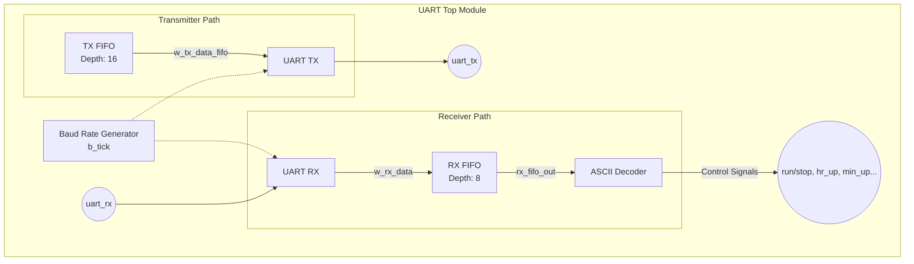

# UART FIFO Verification & ASCII Command Decoder

이 저장소는 **UART 통신(RX/TX)**, **데이터 저장을 위한 FIFO**, 그리고 수신된 데이터를 제어 신호로 변환하는 **ASCII Decoder**를 구현한 SystemVerilog 프로젝트입니다. 또한, 객체 지향 프로그래밍(OOP) 기반의 계층화된 테스트벤치(Layered Testbench)를 통해 데이터 무결성과 커맨드 디코딩의 신뢰성을 검증합니다.

---

## 🏗️ RTL 아키텍처 및 모듈 설명

전체 시스템은 `uart_sv.sv`를 최상위(Top) 모듈로 하여 다음과 같은 하위 컴포넌트로 구성됩니다.

### 1. UART 송수신부 (`uart_rx`, `uart_tx`, `b_tick`)
- **`b_tick`**: 지정된 Baud Rate에 맞춰 UART 통신을 동기화하기 위한 Tick 신호를 생성합니다.
- **`uart_rx`**: 직렬 데이터(`rx`)를 수신하여 8-bit 병렬 데이터로 변환합니다. `START` 비트 감지 후 `DATA` 비트를 수집하고 `STOP` 비트를 검증합니다.
- **`uart_tx`**: 송신용 8-bit 병렬 데이터를 받아 직렬 데이터(`tx`)로 변환해 외부로 전송합니다.

### 2. 동기식 FIFO (`fifo`, `register_file`, `control_unit`)
- 데이터를 안정적으로 버퍼링하기 위해 RX FIFO(깊이: 8)와 TX FIFO(깊이: 16)가 사용됩니다.
- 읽기/쓰기 포인터(Pointer) 기반의 제어 유닛(`control_unit`)을 통해 `full` 및 `empty` 상태를 관리하여 데이터 유실을 방지합니다.

### 3. ASCII 명령어 디코더 (`ascii_decoder`)
- RX FIFO에서 읽어온 8-bit ASCII 데이터를 기반으로 특정 하드웨어 제어 신호를 생성합니다.
- **디코딩 매핑**:
  - `8'h72` ('r'): Run / Stop (`o_ascii_run_stop`)
  - `8'h75` ('u'): Hour Up (`o_ascii_hour_up`)
  - `8'h6C` ('l'): Minute Up (`o_ascii_min_up`)
  - `8'h64` ('d'): Second Up (`o_ascii_sec_up`)
  - `8'h30` ('0'): Mode Switch (Toggle)
  - `8'h31` ('1'): Stop Watch (Toggle)
  - `8'h32` ('2'): Time Switch (Toggle)

### 📊 System Block Diagram

---

## 🧪 검증 환경 (Layered Testbench)

`tb_uart_veri.sv` 파일에 구현된 이 테스트벤치는 UVM 구조에서 영감을 받은 객체 지향 방식(OOP)으로 설계되었습니다.

- **Transaction (`uart_trans`)**: 검증할 데이터 구조를 정의하며 무작위(Random) 제약 조건을 통해 유효한 ASCII 값만 생성하도록 유도합니다.
- **Generator (`uart_gen`)**: 설정된 횟수만큼 Transaction을 생성하여 Mailbox를 통해 Driver로 전달합니다.
- **Driver (`uart_drv`)**: Transaction 데이터를 실제 물리적인 UART 프로토콜 타이밍(Start, Data, Stop)에 맞춰 Interface에 인가합니다.
- **Monitor (`uart_mon`)**: DUT의 입력/출력 핀 상태를 관찰하여 트랜잭션 형태로 캡슐화한 뒤 Scoreboard로 전달합니다.
- **Scoreboard (`uart_scb`)**: 예상 모델(Reference Model)을 통해 정답을 미리 예측하고, Monitor로부터 받은 실제 동작 결과값(디코딩된 제어 신호 등)과 비교하여 오류를 검출합니다.
- **Environment (`uart_env`)**: 위 모든 검증 컴포넌트들을 인스턴스화하고 메일박스와 인터페이스를 연결합니다.

---
## Simulation 

**FIFO의 동작 시뮬레이션**
- FIFO의 RX_wdata == 6c -> rdata의 값으로 전달
- re(read_enable) 신호도 전달

## Log Data(Scoreboard)

## 🚀 실행 방법 (How to Run)

1. 저장소를 클론(Clone)합니다.
2. Vivado, Questa, VCS 등 SystemVerilog를 지원하는 시뮬레이터를 엽니다.
3. `uart_FIFO_Ascii_Decoder.srcs/RTL/` 내의 설계 파일들과 `tb/tb_uart_veri.sv` 파일 등을 컴파일합니다.
4. 최상위 테스트벤치인 `tb_top` 모듈을 시뮬레이션하여 검증 결과를 확인합니다.
